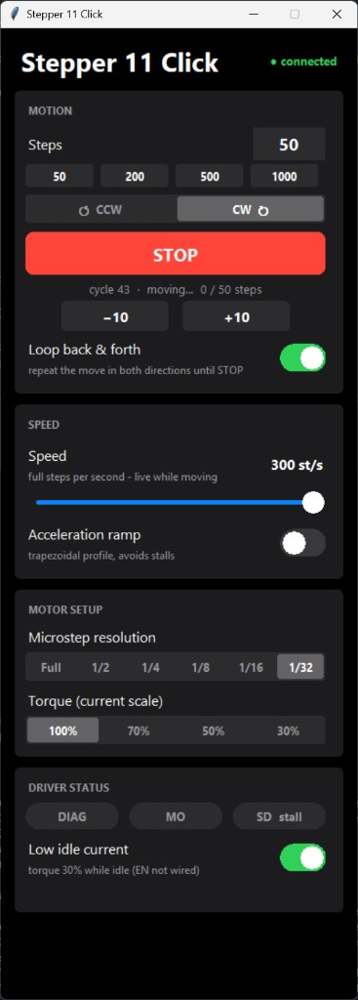
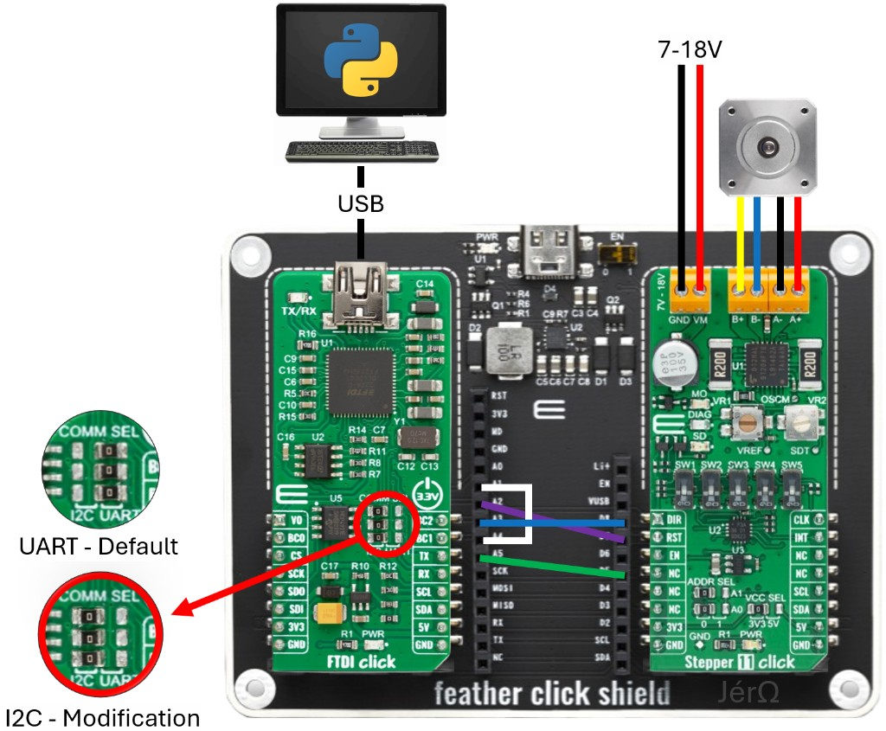

# Stepper 11 Click Motor UI

A Windows Python/Tkinter control panel for the MikroE **Stepper 11 Click**, driven
directly from a PC through an **FT2232H-based FTDI Click**. No microcontroller or
firmware is required.

<p align="center">
  
</p>

The UI provides:

- Signed step moves, CW/CCW direction, jog controls, and continuous back-and-forth motion
- Live speed, microstep-resolution, and torque-scale controls
- Optional acceleration and deceleration ramps
- Live DIAG, motor-origin (MO), and stall-detection (SD) indicators
- Automatic FTDI reconnection and low idle-current mode

## Before powering on

> [!CAUTION]
> Disconnect the 7–18 V motor supply while changing wiring. Secure the motor
> before testing, set the phase-current limit with VR1, and keep a physical way
> to remove motor power. The UI STOP button is not an emergency stop. With an
> acceleration ramp enabled, the current ramped leg finishes before STOP takes
> effect. The motor can remain energized after a move.

## Bill of materials

| Qty | Item | Notes |
| ---: | --- | --- |
| 1 | [MikroE Stepper 11 Click](https://www.mikroe.com/stepper-11-click) | TB9120AFTG stepper driver with PCA9538A I2C expander |
| 1 | [MikroE FTDI Click](https://www.mikroe.com/ftdi-click) | FT2232H USB bridge |
| 1 | [MikroE Feather Click Shield](https://www.mikroe.com/feather-click-shield) | FTDI Click in the left socket; Stepper 11 Click in the right socket |
| 1 | [STEPPERONLINE 17HS08-1004-ME1K](https://www.omc-stepperonline.com/nema-17-closed-loop-stepper-motor-16ncm-22-7oz-in-with-magnetic-encoder-1000ppr-4000cpr-17hs08-1004-me1k) | Four-wire bipolar motor, 1.0 A/phase, 200 steps/rev, magnetic encoder |
| 1 | Regulated 7–18 V DC supply | Use a conservative current limit during bring-up |
| 1 | USB data cable | Must match the FTDI Click connector and support data |
| 4 | Female-to-female Dupont jumper wires | Connect the exposed Feather header pins |
| 1 set | Fine soldering tools | Required to move both FTDI Click COMM SEL 0 Ω links from UART to I2C |
| 1 | Current-measurement method | Needed to set the motor phase current with VR1 |

## Hardware setup

This wiring is for the exact arrangement shown below: **FTDI Click on the left**
and **Stepper 11 Click on the right**, with no Feather board installed.



### Board configuration

| Board | Setting | Required value |
| --- | --- | --- |
| FTDI Click | COMM SEL | Move both 0 Ω links from the factory UART position to the I2C position |
| Stepper 11 Click | VCC SEL | `3V3` |
| Stepper 11 Click | ADDR SEL A1/A0 | `0/0`, giving I2C address `0x70` |
| Stepper 11 Click | SW1–SW5 | Leave at their defaults; the UI programs resolution and torque over I2C |

### Connections

| From | To | Purpose |
| --- | --- | --- |
| PC USB port | FTDI Click USB connector | USB communication and logic power |
| Feather header `A3` | Feather header `D8` | CLK — step clock |
| Feather header `A2` | Feather header `D7` | RST — driver reset |
| Feather header `A4` | Feather header `A1` | DIR — motor direction |
| Feather header `A5` | Feather header `D5` | EN — driver enable connection |
| 7–18 V supply negative | Stepper 11 `GND` terminal | Motor-supply return |
| 7–18 V supply positive | Stepper 11 `VM` terminal | Motor power |
| Motor coil B, lead 1 | Stepper 11 `B+` | Yellow lead on the pictured motor |
| Motor coil B, lead 2 | Stepper 11 `B-` | Blue lead on the pictured motor |
| Motor coil A, lead 1 | Stepper 11 `A-` | Black lead on the pictured motor |
| Motor coil A, lead 2 | Stepper 11 `A+` | Red lead on the pictured motor |

Motor wire colors are not universal. Identify the two coil pairs from the motor
datasheet or with a meter, then connect each pair to its matching A or B
terminals.

The current UI does not actively drive the connected EN line. It relies on the
board's enabled state and reduces the torque setting to 30% while idle. This is
why the UI screenshot describes EN as “not wired” even though the physical
jumper is present.

### Verified FT2232H mapping

| Function | FT2232H channel and pin |
| --- | --- |
| I2C to PCA9538A | Channel A, `ftdi://ftdi:2232h/1` |
| RST | Channel B, BC0 / GPIO bit 8 |
| DIR | Channel B, BC1 / GPIO bit 9 |
| CLK | Channel B, BC2 / GPIO bit 10 |

### Set the phase current

VR1 sets the reference phase-current limit used by the UI's **100%** torque
setting. Calibrate VR1 so that 100% produces the intended phase current for
your motor (1.0 A/phase for the tested 17HS08-1004-ME1K); do not automatically
turn VR1 to its maximum. The other UI settings select 70%, 50%, or 30% of that
calibrated limit.

1. Begin with a conservative bench-supply current limit.
2. Select **100% torque** in the UI.
3. Run the motor slowly or hold it energized.
4. Measure phase current and carefully adjust VR1 to the motor's required value.

VR2 adjusts the stall-detection threshold; it does not set motor current.

## Windows installation

Python 3 with Tkinter is required (Python 3.12 is tested). The standard
installer from [python.org](https://www.python.org/downloads/windows/) includes
Tkinter.

```powershell
git clone https://github.com/JeromeDemers/stepper11-click-ftdi.git
cd stepper11-click-ftdi
py -m venv .venv
.\.venv\Scripts\python.exe -m pip install -r requirements.txt
```

### FTDI driver

Start with the normal FTDI driver installed automatically by Windows. The
application tries the D2XX backend first, so **Zadig is not required**.

If the FTDI interfaces have already been changed to WinUSB with Zadig, the code
falls back to `pyftdi`. Both FT2232H interfaces must use the same intended
driver setup. Changing them to WinUSB disables D2XX until the standard FTDI
driver is restored.

Check that Python can see the adapter:

```powershell
.\.venv\Scripts\python.exe -m stepper11_ftdi.tools.scan_devices
```

At least one backend should list the FT2232H interfaces.

## Run the UI

Connect USB first, verify the wiring, and then enable the 7–18 V motor supply:

```powershell
.\.venv\Scripts\python.exe examples\motor_ui.py
```

The status at the upper right changes to **connected** when both FT2232H
channels and the Stepper 11 I2C expander are available.

### Controls

- **Steps:** Enter a full-step count or use a 50/200/500/1000 preset.
- **CW / CCW:** Select direction, then press GO.
- **STOP:** Stops between motion chunks when ramping is off. See Known limitations.
- **−10 / +10:** Jog ten full steps in either direction.
- **Loop back & forth:** Repeats the selected move until STOP is pressed.
- **Speed:** Select 10–300 full steps per second.
- **Acceleration ramp:** Select 50–600 full steps/s² to reduce fast-start stalls.
- **Microstep resolution:** Select full, 1/2, 1/4, 1/8, 1/16, or 1/32 step.
- **Torque:** Select a scale relative to the phase current set with VR1.
- **DIAG / MO / SD:** View driver fault, motor-origin, and stall states.
- **Low idle current:** Returns the torque scale to 30% after a move.

## Troubleshooting

### The UI stays on “not connected”

- Run `python -m stepper11_ftdi.tools.scan_devices`.
- Confirm both FT2232H interfaces are visible and not open in another program.
- Keep the normal Windows FTDI driver for D2XX, or use WinUSB consistently for
  the `pyftdi` fallback.

### FTDI is detected, but the Stepper 11 is not

- Verify both FTDI Click COMM SEL links are in the **I2C** position.
- Verify Stepper 11 `VCC SEL = 3V3` and `ADDR SEL = 0/0`.
- Confirm the PCA9538A responds at address `0x70`.

### Status works, but the motor does not move

- Confirm all four Feather-header jumpers match the connection table.
- Confirm 7–18 V is present between `VM` and `GND`; USB powers the logic only.
- Verify the two motor coil pairs and terminal order.
- Start at a low speed and enable the acceleration ramp for faster moves.

### Motion is rough, reversed, or stalls

- Full-step motion is naturally more noticeable; try 1/8 microstepping.
- Swap a coil pair or reverse the direction selection if shaft direction differs.
- Lower the speed, use the ramp, and set VR1 for the motor's rated phase current.
- The SD threshold is adjusted with VR2.

## Known limitations

- The default UI connection is fixed to the pictured dual-channel FT2232H rig:
  I2C on channel A and CLK/DIR/RST on channel B.
- STOP is responsive between constant-speed chunks, but a ramped move is issued
  as one blocking profile and completes its current leg before stopping.
- The connected EN line is not configured by the UI, so low idle current is a
  30% torque setting rather than a true driver disable.
- Closing the window does not explicitly close the FTDI links; the operating
  system releases them when the Python process exits.

## Project layout

```text
examples/
    motor_ui.py          Tkinter motor-control application
images/
    connection-diagram.png
    motor-ui.png
stepper11_ftdi/
    d2xx_link.py         Windows FTDI D2XX backend
    ftdi_link.py         pyftdi/WinUSB backend
    pca9538a.py          I2C expander driver
    stepper11.py         Stepper 11 high-level motor driver
    tools/
        scan_devices.py  FTDI backend/device check
requirements.txt
```

## License

Released under the [MIT License](LICENSE).
